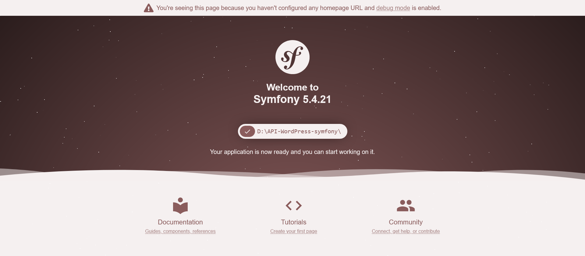
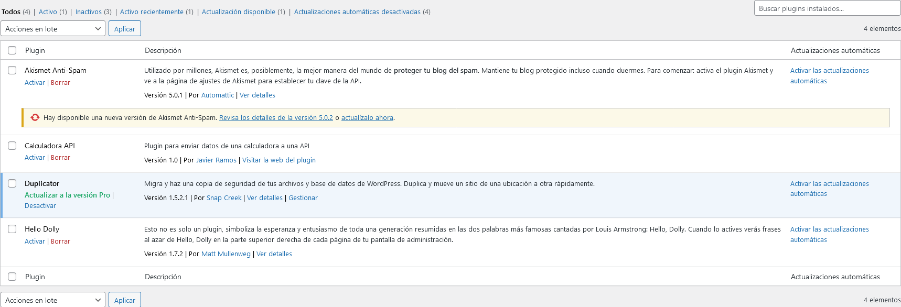
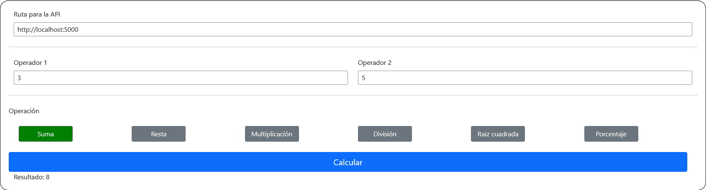

# Proyecto API-WordPress

Desarrollo de una calculadora en forma de plugin para WordPress que solicita a una API el resultado de un cálculo matemático.

El proyecto consta de un plugin para WordPress llamado *calculadora* y una instalación de Symfony 5.4, ambas separadas en dos ramas


## Autor

- [Javier Ramos](https://github.com/JavierRamosGarcia)


## Requisitos

- Composer
- Un servidor con PHP 7.2 o superior
- Soporte de base de datos con MariaDB 10
- Una instalación de WordPress operativa


## Instalación

Para que el proyecto funcione correctamente primero descarga los archivos de Symfony de la rama *symfony*, accede a la raíz del proyecto descargado y ejecuta desde la línea de comandos la siguiente orden.

```bash
  composer install
```
Una vez instaladas todas las dependencias arranca el servicio desde la terminal usando el comado *serve*.

```bash
  symfony serve:start --port=5000
```

Siguiendo las instrucciones adjuntas deberías ver la página de Symfony al visitar *localhost:5000* en tu navegador



Ahora descarga el plugin de WordPress desde la rama *plugin* y copialo dentro de la carpeta plugins de tu instalación de WordPress. Actívalo desde la sección de plugins y ya lo tendrás disponible en el panel de administración.



## Funcionamiento

Una vez tengas los dos programas en funcionamiento entra con tu cuenta a WordPress y haz clic en la calculadora. Ahí verás un formulario con varios campos:

* Ruta de la API (obligatorio)
Escribe la ruta absoluta donde tienes funcionando Symfony. **No incluyas la barra final** (ejemplo: http://localhost:8080)

* Operador 1 (obligatorio)
Primer número de la operación

* Operador 2 (obligatorio)
Segundo número de la operación. **En caso de que vayas a calcular la raiz cuadrada éste campo se desactivará solo y se rellenará con un 0**.

* Operación (obligatorio)
El calculo que realizará la API con los números facilitados. Cuando selecciones una operación ésta cambiará a color verde.



Una vez rellenados todos los datos haz clic en el botón "Calcular" y se realizará la petición a la API. El resultado de la operación aparecerá debajo del botón y en caso de error se abrirá una alerta con el fallo descrito.

## Bugs

El estilo visual de WordPress puede cambiar al activar el plugin *Calculadora API*. Esto es debido a que los archivos de *Bootstrap* se cargan de manera global para toda la web, y no solo para la sección de la calculadora. Se corregirá en futuras versiones.

En el repositorio de Github solo aparece el plugin de WordPress en la rama *master*. Existe un error en el primer commit de la rama *plugin* que elimina todos los archivos que no son del propio plugin, por lo que al hacer *merge* en la *master* borra todos los archivos traídos de la rama *symfony*. Se recomienda descargar los archivos cada uno de su rama propia hasta que se pueda solucionar el problema de la rama *master*
    